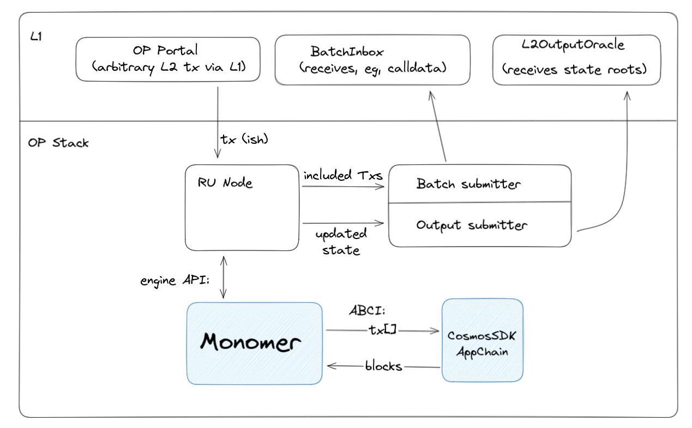

# Monomer

Monomer uses the OP stack to make Cosmos SDK applications deployable as Ethereum rollups.

> ⚠ Monomer is pre-production software and should be used with caution. ⚠

## At a Glance



From the [OP stack](https://specs.optimism.io/protocol/overview.html#components)'s perspective, Monomer replaces the default Ethereum compatible Execution engine. From the [Cosmos-SDK application](https://docs.cosmos.network/v0.50/learn/intro/why-app-specific#what-are-application-specific-blockchains)'s perspective, Monomer replaces the CometBFT consensus layer.

## Development

**Prerequisites:**

- https://github.com/0xFableOrg/roll-op
- `go 1.21` or later

We use [roll-op](https://github.com/0xFableOrg/roll-op) to run local OP stack components. To start the components we need, run the following in separate terminals:

```bash
rollop l1
rollop deploy-l2
rollop l2-sequencer
```

Then to run monomer in dev mode:

```bash
go run ./cmd/monomer
```

## Config

`go run ./cmd/monomer --help` will print available flags. Default config is aligned with defaults from roll-op.

## Building Monomer:

```bash
make
```

or, if replacing an old build,

```bash
make clean
make
```
